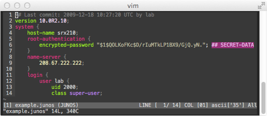

vim-junos-syntax
================

Vim syntax for Junos configuration files

+--------------------------+--------------------------+
| conf syntax example      | |conf_syntax_png|        |
+--------------------------+--------------------------+
| junos syntax example     | |junos_syntax_png|       |
|                          |                          |
|                          | color scheme is molokai_ |
+--------------------------+--------------------------+

.. _molokai: https://github.com/tomasr/molokai

Install
=======

Copy or soft link the respective ``junos.vim`` files into your
``~/.vim/syntax`` and ``~/.vim/ftdetect`` directories.

Related
=======

Scott Ware maintains vim-slax_: syntax coloring of slax, xslt-style language,
which is used for automation in Juniper Junos devices.

.. _vim-slax: https://github.com/scottdware/vim-slax

License
=======

- LICENSE_ (`MIT License`_)

.. _LICENSE: LICENSE
.. _`MIT License`: http://www.opensource.org/licenses/MIT
